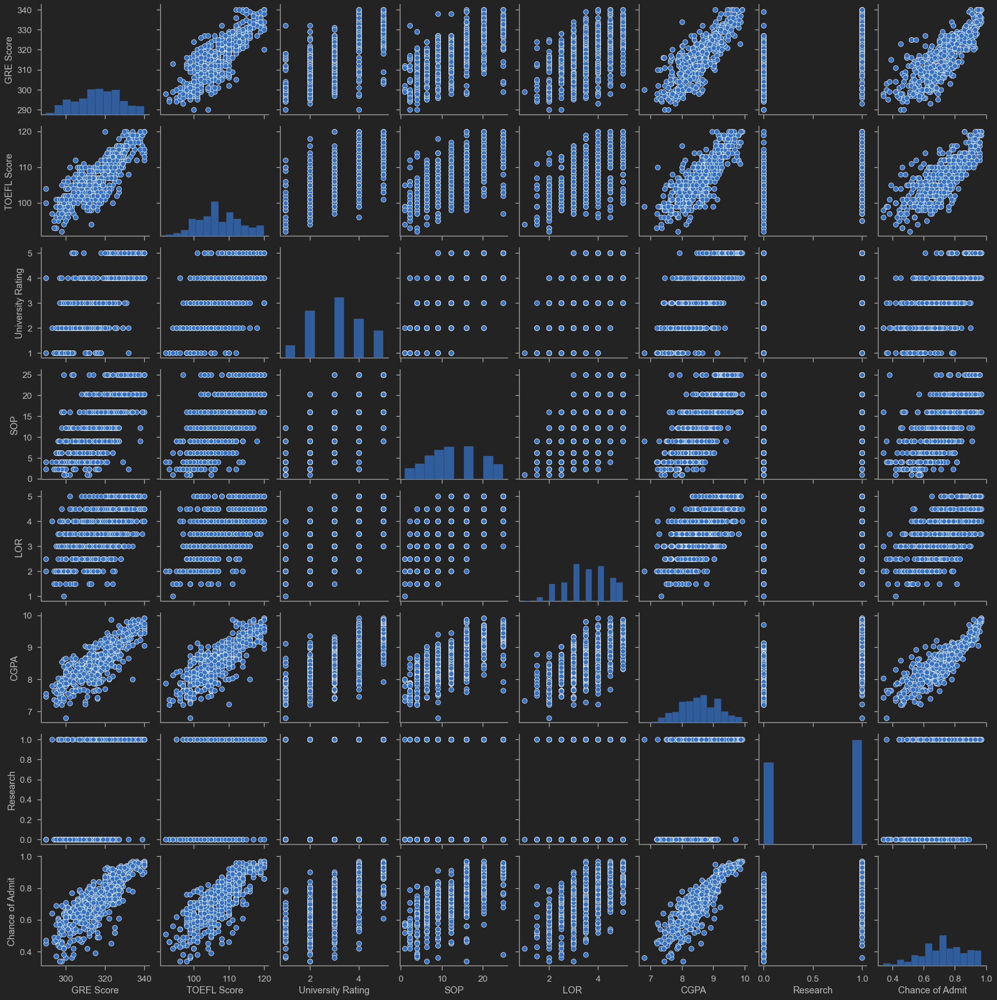
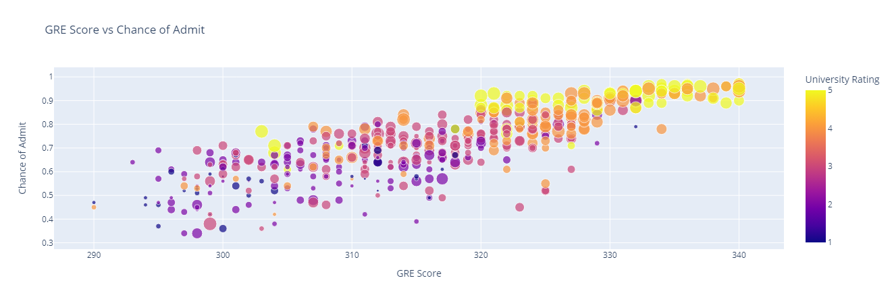

# Evaluate University Admissions Data to Predict the Chances of Admission
## Bayesian Optimisation and Hyperparameter Tuning 

The UCLA University Admission Data Set was evaluated to see if the chance of admission can be predicated. For further details on the data can be found on the [modelcard](https://github.com/saqibsafdar11/Evaluating-university-admissions-data-to-predict-the-chances-of-admission/blob/main/modelcard.md) and [datasheet](https://github.com/saqibsafdar11/Evaluating-university-admissions-data-to-predict-the-chances-of-admission/blob/main/Datasheet.md). Technical documentation of scripts used for model can be found in the [notebook](https://github.com/saqibsafdar11/Evaluating-university-admissions-data-to-predict-the-chances-of-admission/blob/main/Project%20Bayesian%20Optimization%20and%20Hyperparameters%20Tuning.ipynb)

The aim of the project is to learn how to optimise machine learning hyperparameters using the following three strategies:
- Grid Search
- Randomized Search
- Bayesian Optimization

GridSearch optimization works by performing an exhaustive search over a specified list of parameters.

RandomizedSearchCV works by evaluating a select few numbers of random combinations inwhich developers can specify the number of iterations used.

Bayesian optimization overcomes the drawbacks of random search algorithms by exploring search spaces in a more efficient manner. If a region in the search space appears to be promising , this region should be explored more which increases the chances of achieving better performance.

Hyperparameter optization is a ket in developing machine learning project. After training multiple models, we find tune them so they perform better on a given data set

University admission data was evaluated to see if the chance of admission can be predicated. The following correlations were found:

Admissions was positively correlated to a number of variables which include GRE (Graduate Record Examination) Score  , University Rating and SOP (statement of purpose) as can be seen by this graph which encompasses the findings through representing four dimensions of x-y axis, colour and size

Sections:
- Perform Data Visualization and Prepare the Data for Model Training: This section likely involves exploratory data analysis (EDA) and preprocessing steps to get the data ready for modeling.

- Training an XG-Boost Algorithm Without Optimization: Focuses on setting up a baseline XGBoost regressor model without any hyperparameter tuning to establish a performance benchmark.

- Perform Hyperparameters Optimisation using Gridsearch: Explores the use of GridSearchCV for exhaustive hyperparameter optimization to improve model performance.

- Hyperparameter Optimisation Using Random Search Method: Discusses the implementation of Random Search for hyperparameter tuning as a more efficient alternative to GridSearchCV in some scenarios.

- Hyperparameter Optimisation Using Bayesian Optimisation: Details the application of Bayesian Optimization for hyperparameter tuning, highlighting its efficiency in finding the best model parameters.

- Key Findings:
Of the three methods of hyperparameter tuning, Bayesian optimisation provided the best results.

- XG-Boost Algorithm Without Optimization: 66% accuracy
- Gridsearch Method : 83.8 % accuracy
- Random Search Method: 83.7% accuracy
- Bayesian Optimisation Method: 84.3% accuracy
